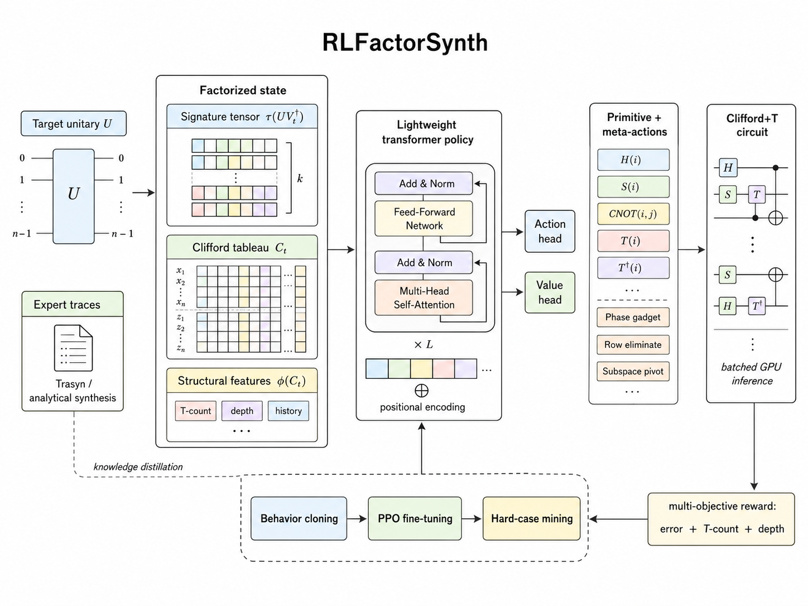

<div style="text-align: center;">
  
</div>


### Nathan Delcid

### University of Colorado Boulder


## Overview

This repository contains a functional implementation of **RLFactorSynth**, a deep reinforcement learning approach to fast unitary synthesis for quantum computing. The project aims to achieve Trasyn-level T-count quality with 10-80× wall-clock speedup through knowledge distillation, efficient neural architectures, and batched GPU inference.

## Key Features Implemented

### 1. Quantum Computing Primitives (`src/rlfactorsynth/quantum/`)
- **gates.py**: Clifford+T gate set with operations
  - Single-qubit gates: H, T, T†, S, S†, Z
  - Gate application to unitaries
  - T-count and Clifford count utilities
  
- **unitary.py**: Unitary matrix operations
  - Distance metrics (operator norm, Frobenius, trace)
  - Random unitary generation (Haar measure)
  - Residual computation
  - Low-rank approximation for signature tensor encoding
  
- **clifford_tableau.py**: Efficient Clifford tracking
  - Binary symplectic representation
  - O(n²) space complexity vs. O(2^(2n)) for full unitary
  - Gate application: H, S, S†, Z, X, Y, CNOT

### 2. RL Environment (`src/rlfactorsynth/envs/`)
- **synthesis_env.py**: Unitary synthesis environment
  - Factorized state encoding (signature tensor + Clifford tableau + features)
  - Action space: primitive gates + meta-actions
  - Action masking for invalid moves
  - Multi-objective reward function
  
- **rewards.py**: Reward scheduling and curriculum learning
  - Dynamic weight scheduling (α, β, γ for T-count, Clifford, depth)
  - Precision curriculum (ε: 10⁻³ → 10⁻⁶)
  - Linear, exponential, and cosine schedules

### 3. Neural Network Models (`src/rlfactorsynth/models/`)
- **encoders.py**: Factorized state encoders
  - SignatureTensorEncoder: Low-rank factorization of residual
  - CliffordTableauEncoder: Binary symplectic representation
  - StructuralFeaturesEncoder: T-count, depth, gate history
  - FactorizedStateEncoder: Fusion of all components
  - RawMatrixEncoder: Baseline for ablations
  
- **transformer_policy.py**: Transformer policy/value network
  - 4-layer transformer with 8-head attention
  - Policy head with masked action selection
  - Value head for advantage estimation
  - Gradient checkpointing support

### 4. Training (`src/rlfactorsynth/rl/`)
- **ppo.py**: Proximal Policy Optimization
  - GAE (Generalized Advantage Estimation)
  - Clipped surrogate objective
  - Value function loss
  - Entropy bonus
  - Mixed precision training support

### 5. Scripts (`scripts/`)
- **train_ppo.py**: Complete PPO training pipeline
  - Hydra configuration integration
  - Curriculum learning
  - Checkpointing and logging
  - Progress tracking with tqdm
  
- **synthesize.py**: Inference script
  - Single unitary synthesis
  - Batch synthesis support
  - Performance metrics (T-count, time, success rate)
  - Multiple operating modes

### 6. Configuration (`configs/`)
- **default.yaml**: Main configuration
- **env/single_qubit.yaml**: Environment settings
- **model/transformer.yaml**: Model architecture
- **train/ppo.yaml**: Training hyperparameters

### 7. Testing (`tests/`)
- **test_unitary_distance.py**: Unit tests for distance metrics
  - Identity distance
  - Unitary property checking
  - Random unitary generation
  - Metric consistency

### 8. Documentation
- **README.md**: Comprehensive project documentation
  - Quick start guide
  - Installation instructions
  - Usage examples
  - Troubleshooting
  
- **Notebooks**: Jupyter notebooks for exploration
  - 01_unitary_basics.ipynb: Basic quantum operations
  - 02_gridsynth_trasyn_demo.ipynb: A demo of how these routines decompose unitaries, respectively

## Architecture Highlights

### Factorized State Encoding
The key innovation is representing the synthesis state efficiently:

```
State = {
  Signature Tensor: O(T×d) - Low-rank factorization of residual unitary
  Clifford Tableau: O(n²) - Binary symplectic representation
  Structural Features: O(1) - T-count, depth, gate history
}
```

This reduces memory from O(2^(2n)) to O(Td + n²), enabling larger circuits and batch processing.

### Transformer Architecture
```
Input: Factorized State
  ↓
Encoders (Signature, Tableau, Features)
  ↓
Fusion Layer (768-dim)
  ↓
4-layer Transformer (8 heads, 2048 FFN)
  ↓
Policy Head (masked softmax) + Value Head
```

### Training Pipeline
```
1. Generate expert trajectories (heuristic beam search)
2. Imitation learning (distillation)
3. PPO fine-tuning with curriculum learning
4. Online distillation on hard instances
```

## What's Included

* **Complete repository structure**
* **Core quantum primitives**
* **Factorized state encoding**
* **RL environment with action masking**
* **Transformer policy architecture**
* **PPO training implementation**
* **Inference scripts**
* **Configuration system (Hydra)**
* **Unit tests**
* **Documentation and README**
* **Docker support**
* **Makefile for common commands**

## What's Simplified/Placeholder

* **Meta-actions library**: Currently has placeholder examples. Full implementation would mine frequent patterns from Trasyn enumeration.

* **Expert policy**: Uses simplified heuristic beam search instead of full Trasyn integration.

* **Batched environment**: Single environment implemented; vectorized batch environment would require additional work.

* **Benchmark datasets**: Interface provided but actual Trasyn 187 circuits would need to be loaded separately.

* **Multi-qubit support**: Architecture supports it but needs more testing and optimization.

## Next Steps to Complete

1. **Implement meta-actions library**:
   - Mine frequent gate patterns from expert trajectories
   - Add hardware-specific fusions (T-T-T-T → S-S)
   - Precompute optimal Rz(θ) decompositions

2. **Integrate real expert policy**:
   - Interface with Trasyn or implement gridsynth
   - Generate high-quality training data
   - Implement knowledge distillation loss

3. **Add batched environment**:
   - Vectorize environment operations
   - GPU-accelerated state updates
   - Parallel unitary synthesis

4. **Implement evaluation suite**:
   - Load benchmark circuits (Trasyn 187, etc.)
   - Compute quality metrics vs. baselines
   - Generate comparison plots

5. **Add ablation studies**:
   - FFNN vs. Transformer
   - Factorized vs. raw encoding
   - Different curriculum schedules

6. **Optimize for production**:
   - Model quantization
   - ONNX export
   - Inference optimization

## Usage Example

```bash
# Setup
cd rlfactorsynth
make setup

# Train
python scripts/train_ppo.py

# Synthesize
python scripts/synthesize.py \
  --checkpoint checkpoints/final.pt \
  --n_qubits 1 \
  --n_random 10

# Test
make test
```

## Dependencies

- PyTorch (deep learning)
- NumPy (numerical computing)
- SciPy (scientific computing)
- Hydra (configuration)
- Qiskit (quantum computing, optional)
